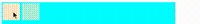

#  CrDom.js
## 这是一个类似于jquery的js库，操作dom,用来构造动画和一些其他的js方法库,也采用了链式调用

| 方法与属性   | 作用 |  
| :-------------: | :---------- | 
|<a href="#1">`$()`</a> | 获取dom元素，并返回CrDOM对象，后面所有的操作都要基于这个方法实现    | 
|`CrDom`|版本信息|
|`dom`| 这个属性上存放了 `$()`方法获得的dom节点使用数组存放 |
|`ObjectMethodStatus`| 该属性上存放了淡入淡出的一些配置|
|`txt`|属性中放了`addText()`方法添加的文本|
|<a href="#2">`eq()`</a>| 该方法用来选择通过`$()`获取的dom节点的具体值| 
|<a href="#3">`css()`</a>| 用来修改元素样式| 
|<a href="#4">`on()`</a>| 用来绑定事件|
|<a href="#5">`addText()`</a>| 用来在dom中添加文本|
|<a href="#5">`setClass()`</a>| 重新设置元素类名|
|<a href="#5">`addClass()`</a>|向类名中添加新类名 |
|<a href="#5">`clearClass()`</a>| 删除指定类名|
|<a href="#6">`addHTML()`</a>| `DOM` 节点中添加 `html` 元素|
|<a href="#7">`display()`</a>| 元素的显示与隐藏|
|<a href="#8">`slowin()`</a>|元素淡入 |
|<a href="#8">`slowou()`</a>| 元素淡出|   
|<a href="#8">`change()`</a>|淡入淡出交替 |    
|<a href="#9">`stop()`</a>| 暂停变换(淡入淡出) |  
|<a href="#10">`father()`</a>|会获取所有元素的父节点|
|<a href="#11">`brother()`</a>|获取所有兄弟节点|
|<a href="#12">`son()`</a>|获取所有元素的子节点|
|<a href="#13">`progeny()`</a>|获取后代节点|
|<a href="#14">`insert()`</a>|修改`dom`属性中的值|
|<a href="#15">`Attr()`</a>|获得,设置和添加元素属性|
|<a href="#16">`DataBroker()`</a>| 数据监听|
|<a href="#17">`CreateTable()`</a>|渲染表格|

## <font id="1">1</font>. `$()` 方法如同jquery的选择器样，传入参数经过处理后获得dom元素，作为属性放在构造函数身上，之后所有的dom操作都是操作这个属性 
```html
    <div class="a">
        <span></span>
    </div>
```
```js
//使用
 console.log($('.a'));
 console.log($(this));
```
<br>
## <font id="2">2</font>. 在CrDom.js中可以同时获得多个dom元素，形成数组放在构造函数上，可用通过 eq()方法来选择要操作的dom;
```html
    <div class="a">
        <span></span>
        <span></span>
    </div>
```
```js
 console.log($('span').eq(0));
```
<br>
## <font id="3">3</font>. 修改样式 使用 css() 来更改通过传入对象或具体的值来修改
```html
    <div class="a">
        <span>hello</span>
    </div>
```
```js
//使用
1. $('span').css('color', 'red');
2. $('span').css({
       fontSize: '30px'
    });
```
<br>
## <font id="4">4</font>. 绑定事件 通过 on() 来绑定事件
```html
    <div class="a">
        <span></span>
    </div>
```
```js
//使用
 $('span').on('click', function () {
        alert('hello word');
    })
```
## <font id="5">5</font>. 添加文本 添加类名 修改类名 删除指定类名
```html
    <div class="a">
        <span></span>
        <span></span>
    </div>
```
```js
//添加文本  添加的文本会放在对象的 txt 属性中
$('span').eq(0).addText('hello');
//设置类名
$('span').eq(1).setClass('box');
//
```
<br>
```js
//添加类名
$('span').eq(1).addClass('blo');
```
<br>
```js
//删除指定类名
$('span').eq(1).clearClass('blo');
```
## <font id="6">6</font>. `addHTML()`可以向 `DOM` 节点中添加 `html` 元素,
```html
<div id="app"></div>
```
```js
// 方法有两种方式
//1.传入两个参数，第一个参数标签名 string 类型，第二个参数是添加的标签的文本内容
//这种方式如果dom中有内容不会覆盖而是在尾部添加
$('#app').addHTML('span','添加的span标签');
//2.传入一个参数，传入一个含有html标签的字符串数据
$('#app').addHTML('<span>添加的span标签</span>');
```

## <font id="7">7</font>. 元素的隐藏与显示    在点击事件中 请使用 `let node = $('.tu')` 使用变量来接收到实例,不要直接使用 `$('.tu').display()`因为这样每次调用都会生成一个新对象 
```html
    <div class="a">
        <span></span>
        <span></span>
    </div>
```
```js
//直接使用 display() 会隐藏显示交替，传入 false 隐藏 传入 true 显示 
    let node = $('span').eq(1);
    $('span').eq(0).on('click', function () {
        node.display()
    })
```
<br>
## <font id="8">8</font>. 淡入淡出
+ 7.1  淡入 使用 `slowin()` 传入一个时间参数 单位 S 
```html
    <div class="a">
        <span></span>
        <span></span>
    </div>
```
```js
let node = $('span').eq(1);
    $('span').eq(0).on('click', function () {
        node.slowin(1);
    })
```
<br>
+ 7.2 淡出 使用 `slowou()` 传入一个时间参数 单位 S ,单独使用还要传入一个参数 0 (就是只有淡出,没有淡入在它前面)
```html
    <div class="a">
        <span></span>
        <span></span>
    </div>
```
```js
  let node = $('span').eq(1);
    $('span').eq(0).on('click', function () {
        node.slowou(1, 0);
    })
```
<br>
+ 7.3 淡入淡出交替 它是通过分别调用对象内的 淡入淡出 方法实现的 <br>
   使用 `change()` 传入两个参数 第一个是变化时间 单位 S ，第二个是改变第一次调用时是淡入还是淡出 默认参数是 `true` 淡入 
```html
    <div class="a">
        <span></span>
        <span></span>
    </div>
```
```js
    let node = $('span').eq(1);
    $('span').eq(0).on('click', function () {
        node.change(1);
    })
```
<br>
## <font id="9">9</font>. 暂停动画 防止动画快速切换时剧烈变化 使用 `stop()`
```html
    <div class="a">
        <span></span>
        <span></span>
    </div>
```
```js
    let node = $('span').eq(1);
    $('span').eq(0).on('click', function () {
        node.stop().change(1);
    })
```
## <font id="10">10</font>. 获取父节点 `father()`会获取所有元素的父节点
```html
    <div class="a">
        <span></span>
        <span></span>
    </div>
```
```js 
console.log($('span').father());
```
<br>
## <font id="11">11</font>. 获取兄弟节点 `brother()` 获取所有兄弟节点
```html
    <div class="a">
        <span class="one"></span>
        <span class="two"></span>
    </div>
```
```js
    console.log($('span').eq(0).brother());
```
<br>
## <font id="12">12</font>. 获取子节点 `son()` 获取所有元素的子节点
```html
    <div class="a">
        <span class="one"></span>
        <span class="two"></span>
    </div>
```
```js
console.log($('div').son());
```
<br>
## <font id="13">13</font>. 获取后代节点 `progeny()` 必须传参数 可以传 标签名 类名 css选择器
```html
    <div class="a">
        <span class="one">
            <a></a>
        </span>
        <span class="two"></span>
    </div>
```
```js
    console.log($('div').progeny('a'));
```
<br>
## <font id="14">14</font>. `insert()` 方法可以通过传参 修改 `$()` 方法获取的dom节点 `dom` 属性会发生改变，可以传入单个dom节点,有多个dom节点可以通过数组方式传入
```html
    <div class="a">
        <span class="one"></span>
        <span class="two"></span>
    </div>
```
```js
    let node = $('span').on('click', function () {
        node.insert(this);
        console.log(node);
    })
```
<br>
## <font id="15">15</font> `Attr()` 方法可以用来获取，设置，添加元素的属性 例如 `src` `class` `title` 等
```html
    <div class="a">
        <span class="one"></span>
        <span class="two"></span>
    </div>
```
```js
    //获取
    $('span').Attr('class');
    //设置
    $('span').Attr('class','node');
    //添加
    $('span').Attr('index','1');
    //使用数组参数添加属性的值
    //如果传入数组该方法会通过获取元素的个数依次添加数组中的值
    $('span').Attr('index',['1','2','3'],);
    //传入一个空字符串可以添加一个没有值的属性
    $('span').Attr('data-c-1','');
```
## <font id="16">16</font>. `DataBroker()`数据监听,该方法关注的是数据的改变,当数据改变时会调用一个函数在函数中更新页面
## 对数组进行操作只能使用以下 API 操作 
`push()`
`pop()`
`shift()`
`unshift()`
`splice()`
`sort()`
`reverse()`
```js
//方法中有四个参数
//第一个是一个空对象之后的数据会放在这个对象中
//第二个参数是数据对象，其中的数据最后会放在，第一个参数中，
//第三个参数是回调函数在这个函数中更新数据
//第四个参数设置使用方法时是否执行回调函数,默认是 true
    let _data = {}, node = $('em');

    $.DataBroker(_data, { txt: 10 ,data:['1','2']}, () => {
        node.addText(_data.txt);
    })

    setInterval(function () {
        _data.txt++;
    }, 500);
```
<br>
## <font id="17">17</font>. `CreateTable()` 渲染表格，传三个参数 第一个通过 `$()` 选这表格在那个位置 第二个传入数据 以数组对象的形式 第三个是数组参数用来选择需要渲染的参数或修改顺序,&nbsp; 这个方法只会渲染 \<tr> \<td> 元素
```html
    <table>
        <thead>
            <tr>
                <td>id</td>
                <td>城市ID</td>
                <td>城市</td>
                <td>father</td>
            </tr>
        </thead>
        <tbody></tbody>
    </table>
```
```js
    let data = [
        { id: 5, cityID: '130100', city: '石家庄市', father: '130000' },
        { id: 6, cityID: '130200', city: '唐山市', father: '130000' },
        { id: 7, cityID: '130300', city: '秦皇岛市', father: '130000' }
    ];

    $.CreateTable($('tbody'), data);
```
```js
//添加数组参数选择 需要渲染的参数或顺序
    $.CreateTable($('tbody'), data,['id','cityID','city','father'])
```
<br> 
